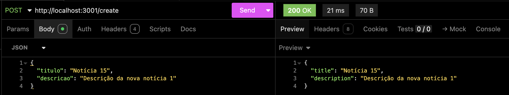
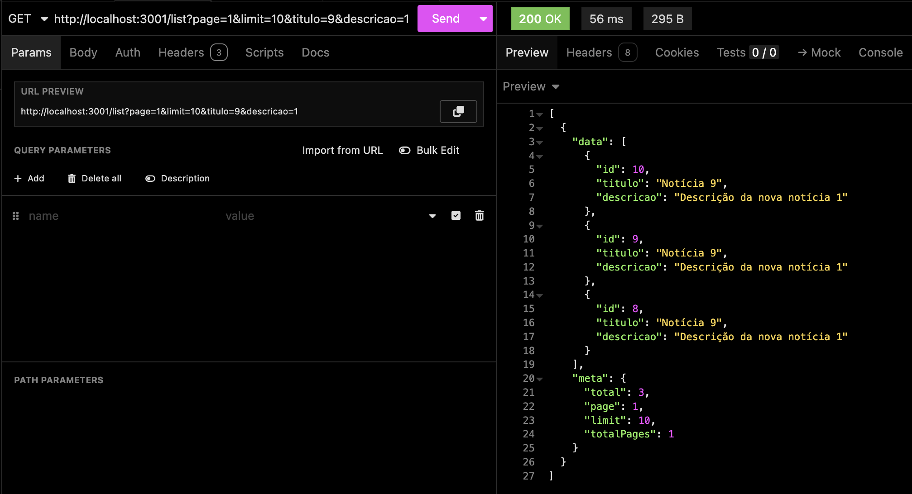
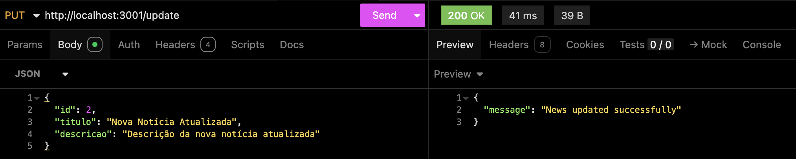
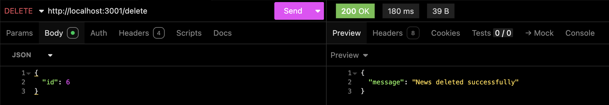
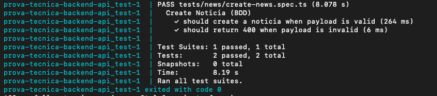

# Prova Técnica Backend

Este é um exemplo de API implementada utilizando Node, Express e Typescript.

## Pré-requisitos

Antes de começar, você precisará ter as seguintes ferramentas instaladas no seu sistema:

- Node.js (>=18.x)
- Npm (>=8.x)
- Docker (>=20.x)

## Configuração Local

### 1. Clonar o Repositório

Clone este repositório para o seu ambiente local:

```bash
git clone https://github.com/JPedroCh/prova-tecnica-backend.git
cd prova-tecnica-backend
```

### 2. Instalar Dependências

Instale as dependências do projeto usando o NPM:

```bash
npm install
```

### 3. Configurar o .env

Crie um arquivo .env seguindo o `.env.example` definindo informações sobre o banco de dados.

```env
DB_HOST=postgres
DB_PORT=5432
DB_USER=postgres
DB_PASSWORD=postgres
DB_NAME=news_db
```

### 4. Iniciar a Aplicação

Inicie a aplicação em ambiente de desenvolvimento:

```bash
npm run dev
```

Obs: Importante ressaltar que para executar sem o docker, é preciso que o banco esteja sendo executado localmente e coerente com as informações informadas no `.env`.

A aplicação estará disponível em `http://localhost:3001`.

## Configuração com Docker

### 1. Construir a Imagem Docker

Para construir a imagem Docker e iniciar todos os contâiners definidos no `docker-compose.yml` execute:

```bash
docker-compose up --build
```

Obs: Serão iniciados os contâiners da API e do banco postgres.

A aplicação estará disponível em `http://localhost:3001`.

## Endpoints

### Criar Notícia

Este endpoint tem como objetivo a criação de uma notícia, são enviados 2 campos obrigatórios: `titulo` e `descricao`, ambos sendo strings.

O curl da requisição para exemplo:

```bash
curl --request POST \
  --url http://localhost:3001/create \
  --header 'Content-Type: application/json' \
  --header 'User-Agent: insomnia/12.1.0' \
  --data '{
  "titulo": "Título da Notícia",
  "descricao": "Descrição da notícia"
}'
```

Exemplo de resultado:




### Listar Notícias

Este endpoint tem como objetivo listar as notícias. O retorno é paginado trazendo dentro do objeto `meta`, as informações: 
- `total` (número total de notícias correspondentes ao filtro aplicado)
- `page` (página atual)
- `limit` (limite de itens da página)
- `totalPages` (número total de páginas de acordo com o filtro aplicado)

Os parâmetros que podem ser enviados como query são:
- `page`: página a ser retornada (default = 1)
- `limit`: limite de itens retornados por página (default = 10)
- `titulo`: palavra ou número para ser buscado na coluna título
- `descricao`: palavra ou número para ser buscado na coluna descrição

O curl da requisição para exemplo:

```bash
curl --request GET \
  --url 'http://localhost:3001/list?page=1&limit=10&titulo=9&descricao=1' \
  --header 'User-Agent: insomnia/12.1.0'
```

Exemplo de resultado:



### Editar/Atualizar Notícia

Este endpoint tem como objetivo atualizar as informações de uma notícia no banco, para isso é necessário enviar os campos: `id`, `titulo` e `descricao`. 

O curl da requisição para exemplo:

```bash
curl --request PUT \
  --url http://localhost:3001/update \
  --header 'Content-Type: application/json' \
  --header 'User-Agent: insomnia/12.1.0' \
  --data '{
	"id": 6,
  "titulo": "Nova Notícia Atualizada",
  "descricao": "Descrição da nova notícia atualizada"
}'
```

Exemplo de resultado:



### Deletar/Remover Notícia

Este endpoint tem como objetivo remover uma notícia do banco, para isso é necessário enviar o campo `id`, o qual é obrigatório e é um number.

O curl da requisição para exemplo:

```bash
curl --request DELETE \
  --url http://localhost:3001/delete \
  --header 'Content-Type: application/json' \
  --header 'User-Agent: insomnia/12.1.0' \
  --data '{
  "id": 6
}'
```

Exemplo de resultado:



## Testes

### BDD

O BDD é uma prática de desenvolvimento de software que envolve colaboração entre desenvolvedores, QA e não-programadores para definir o comportamento desejado de uma aplicação através de exemplos de uso compreensíveis para todos.

Os testes foram implementados utilizando o `jest` e estão no arquivo `tests/news/create-news.spec.ts`. Para executar os testes é preciso já ter executado o comando:

```bash
npm install
```

Já tem configurado o arquivo `.env.test`, basta executar o comando:

```bash
docker compose -f docker-compose.test.yml up --build
```

O comando irá criar uma imagem e subir contâiners para executar os testes, isso se deve para utilizar o banco de testes.

O resultado esperado é o seguinte:



## Contribuição

Se você deseja contribuir para este projeto, por favor siga estas etapas:

1. Fork o repositório
2. Crie uma nova branch (`git checkout -b feature/nova-funcionalidade`)
3. Commit suas alterações (`git commit -m 'Adiciona nova funcionalidade'`)
4. Push para a branch (`git push origin feature/nova-funcionalidade`)
5. Abra um Pull Request para a branch `develop`

## Estrutura de Pastas/Arquivos


```bash
prova-tecnica-backend/
├── src/
│   ├── infra/
│   │   ├── database/
│   │   │   └── config.ts
│   │   ├── cache/
│   │   │   └── news-cache.ts
│   ├── shared/
│   │   ├── http.ts
│   │   ├── utils/
│   │   │   └── is-positive-integer.ts
│   │   └── zod-middleware.ts
│   ├── api/
│   │   ├── repositories/
│   │   │   └── news/
│   │   │       ├── news-typeorm-repository.ts
│   │   │       ├── news-repository.ts
│   │   │       └── news-entity.ts
│   │   ├── adapters/
│   │   │   └── express-router.ts
│   │   ├── validators/
│   │   │   ├── list-news-validator.ts
│   │   │   ├── delete-news-validator.ts
│   │   │   ├── update-news-validator.ts
│   │   │   ├── create-news-validator.ts
│   │   │   └── index.ts
│   │   ├── controllers/
│   │   │   └── news/
│   │   │       ├── create-news.ts
│   │   │       ├── update-news.ts
│   │   │       ├── list-news.ts
│   │   │       ├── delete-news.ts
│   │   │       └── index.ts
│   │   ├── routes/
│   │   │   └── index.ts
│   │   └── services/
│   │       ├── type.ts
│   │       └── news/
│   │           ├── create-news.ts
│   │           ├── update-news.ts
│   │           ├── list-news.ts
│   │           ├── delete-news.ts
│   │           └── index.ts
│   ├── errors/
│   │   ├── not-found.ts
│   │   ├── server-error.ts
│   │   ├── bad-request.ts
│   │   └── news/
│   │       ├── update.ts
│   │       └── delete.ts
│   ├── app.ts
│   └── main.ts
├── jest.config.ts
```

### Descrição das Pastas e Arquivos
- **`infra/`** -> conexão com banco, cache e filas (serviços externos).

- **`shared/`** -> utilitários, middlewares, helpers e tipos globais.

- **`api/`** -> todo o código de domínio da aplicação:

- **`repositories`** -> acesso a dados.

- **`controllers`** -> entrada HTTP.

- **`services`** -> regras de negócio.

- **`validators`** -> validação de entrada.

- **`adapters`** -> conexão com frameworks (Express, etc).

- **`routes`** -> definição de rotas.

- **`errors/`** -> tratamento de erros estruturado.

- **`app.ts / main.ts`** -> bootstrap da aplicação.

- **`jest.config.ts`** -> configuração de testes.

### Preparação para Escalar

Para escalar o projeto, basta seguir o padrão já definido crian novo módulo dentro das pastas:
- services
- controllers
- repositories
- validators
- errors

Em geral a estrutura consegue escalar bem, porém com possibilidade de melhorias, como:
- Aplicar injeção de dependência nos services e repositórios
- Adicionar loggers para monitoramento e observabilidade
- Escrever testes unitários para aumentar a cobertura

## Licença

Este projeto está licenciado sob a MIT License - veja o arquivo [LICENSE](LICENSE) para mais detalhes.